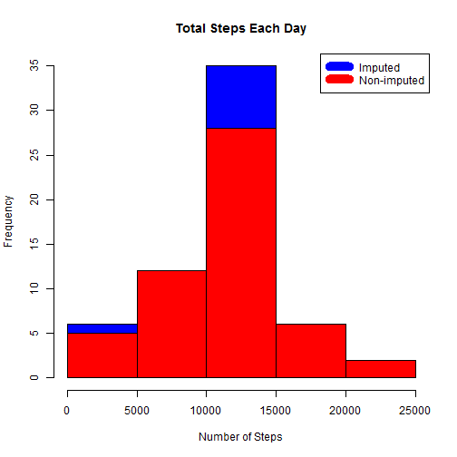

## Loading and preprocessing the data
Download, unzip and load data into data frame `activity`. 

```r
temp <- tempfile()
download.file("https://github.com/jorgelmarquez94/RepData_PeerAssessment1/blob/master/activity.zip",temp)
unzip(temp)
```

```
## Warning in unzip(temp): error 1 in extracting from zip file
```

```r
unlink(temp)
activity <- read.csv("activity.csv")
```


## What is mean total number of steps taken per day?
Calculate sum of steps per day, create histogram

```r
steps_per_day <- aggregate(steps ~ date, activity, sum)
hist(steps_per_day$steps, 
     main = "Total Steps Taken per Day", 
     col="blue", 
     xlab="Number of Steps")
```


Calculate mean and median.

```r
totalmean <- mean(steps_per_day$steps)
totalmedian <- median(steps_per_day$steps)
```

* The mean is

```r
totalmean
```

```
## [1] 10766.19
```
* The median is

```r
totalmedian
```

```
## [1] 10765
```


## What is the average daily activity pattern?
Calculate average steps per day. 
Plot the average steps in an interval of time. 

```r
steps_by_interval <- aggregate(steps ~ interval, activity, mean)
plot(steps_by_interval$interval,
     steps_by_interval$steps, 
     type="l", 
     xlab="5-Minute Interval", 
     ylab="Average Number of Steps",
     main="Average Number of Steps per Day by Interval")
```


Find interval with max steps interval.

```r
max_steps_interval <- steps_by_interval[which.max(steps_by_interval$steps),1]
```
* The maximum number of steps is

```r
max_steps_interval 
```

```
## [1] 835
```

## Imputing missing values
Missing data needed to be imputed. 

```r
incomplete <- sum(!complete.cases(activity))
imputed_data <- transform(activity, 
                          steps = ifelse(is.na(activity$steps), steps_by_interval$steps[match(activity$interval, steps_by_interval$interval)], activity$steps))
```

Zeroes were imputed for 10-01-2012.

```r
imputed_data[as.character(imputed_data$date) == "2012-10-01", 1] <- 0
```

Recount total steps per day and create histogram. 

```r
steps_per_day_new <- aggregate(steps ~ date, imputed_data, sum)
hist(steps_per_day_new$steps, main = paste("Total Steps Each Day"), col="blue", xlab="Number of Steps")

hist(steps_per_day$steps, main = paste("Total Steps Each Day"), col="red", xlab="Number of Steps", add=T)
legend("topright", c("Imputed", "Non-imputed"), col=c("blue", "red"), lwd=10)
```



Calculate new mean and median for imputed data. 

```r
newmean <- mean(steps_per_day_new$steps)
newmedian <- median(steps_per_day_new$steps)
```

* The new mean for imputed data is

```r
newmean
```

```
## [1] 10589.69
```
* The new median for imputed data is

```r
newmedian 
```

```
## [1] 10766.19
```

Calculate difference between imputed and non-imputed data.

```r
meandiff <- newmean - totalmean
mediandiff <- newmedian - totalmedian
```

* The difference between the non-imputed mean and imputed mean is

```r
meandiff
```

```
## [1] -176.4949
```
* The difference between the non-imputed mean and imputed median is

```r
mediandiff
```

```
## [1] 1.188679
```

Calculate total difference.

```r
totaldiff <- sum(steps_per_day_new$steps) - sum(steps_per_day$steps)
```

* The difference between total number of steps between imputed and non-imputed data is

```r
totaldiff
```

```
## [1] 75363.32
```

## Are there differences in activity patterns between weekdays and weekends?
Created a plot to compare and contrast number of steps between the week and weekend.

```r
weekends <- c("sábado", "domingo")
imputed_data$dow = as.factor(ifelse(is.element(weekdays(as.Date(imputed_data$date)),weekends), "Weekend", "Weekday"))

steps_by_interval_i <- aggregate(steps ~ interval + dow, imputed_data, mean)

library(lattice)

xyplot(steps_by_interval_i$steps ~ steps_by_interval_i$interval|steps_by_interval_i$dow, main="Average Steps per Day by Interval",xlab="Interval", ylab="Number of Steps",layout=c(1,2), type="l")
```


